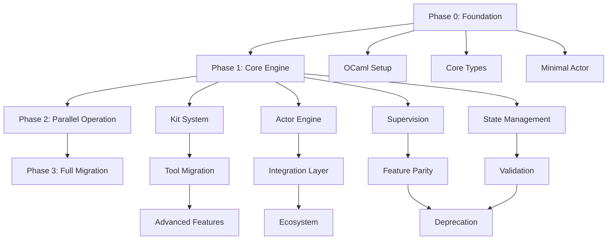

# OPACK to Opaca Migration Roadmap

**Status:** Draft v0.1  
**Last Updated:** 2026-06-29  
**Decision:** Migrate from C++ OPACK (Flecs ECS) to OCaml 5 Opaca (Riot actors)

---

## Executive Summary

This roadmap outlines the migration from OPACK (C++ ECS-based agent framework) to Opaca (OCaml 5 actor-based security research engine). The migration transforms a template-heavy, compile-time ECS system into a runtime-flexible, kit-based actor system with supervision and hot-swappable behavior.

**Timeline Estimate:** 6-9 months (3 phases)  
**Risk Level:** Medium-High (new runtime, paradigm shift)  
**Rollback Strategy:** Parallel operation during Phase 2, feature flags in Phase 3

---

## 1. Current State Analysis (OPACK)

### 1.1 Architecture Overview

**Core Components:**
- **Flecs ECS Runtime** — Entity-Component-System substrate
- **Action System** — Actuators execute actions with lifecycle hooks (begin/update/end)
- **Perception System** — Entities perceive other entities through senses
- **Operation System** — Composable operations with inputs/outputs
- **Behavior System** — Agents have behaviors that impact operations

**Key Abstractions:**
```cpp
// Actions with required actuators
OPACK_ACTION(MyAction)
opack::init<MyAction>(world)
    .require<MyActuator>()
    .on_begin([](entity){...})
    .on_update([](entity, dt){...})
    .on_end([](entity){...});

// Actors with actuators
OPACK_SUB_PREFAB(MyAgent, opack::Agent)
opack::add_actuator<MyActuator, MyAgent>(world);

// Execution
auto agent = opack::spawn<MyAgent>(world);
opack::act(agent, opack::spawn<MyAction>(world));
```

**Dependencies:**
- Flecs 3.x (ECS core)
- CMake build system
- C++20 features (concepts, ranges)
- fmt library for formatting
- doctest for testing

**Strengths:**
- Compile-time type safety
- Zero-cost abstractions
- Composable ECS architecture
- Action tracking and history
- Supervision through Flecs hierarchy

**Weaknesses:**
- No runtime hot-swap (requires recompilation)
- Template complexity limits extensibility
- Tight coupling to Flecs
- No native actor isolation
- Limited concurrency model

### 1.2 Component Inventory

| Component | Purpose | Lines of Code | Complexity | Migration Priority |
|-----------|---------|---------------|------------|-------------------|
| `action.hpp` | Action lifecycle & actuators | ~600 | High | P0 (Core) |
| `components.hpp` | ECS components | ~200 | Medium | P0 (Core) |
| `perception.hpp` | Entity perception | ~300 | Medium | P1 (Feature) |
| `operation.hpp` | Composable operations | ~400 | High | P2 (Advanced) |
| `simulation.hpp` | World management | ~250 | Medium | P0 (Core) |
| `communication.hpp` | Entity messaging | ~200 | Low | P1 (Feature) |

**Total Estimated LOC:** ~2,000 C++ (core), ~5,000 including modules/examples

---

## 2. Target State (Opaca)

### 2.1 Architecture Vision

**Core Primitives:**
- **Actor** — Riot process running a kit, seeded for determinism
- **Kit** — Bundle of tools + switch rules (declarative)
- **Finding** — Typed result (surface/vuln/exploit/chain/report)
- **Supervisor** — Fault-tolerant process tree
- **Store** — Persistent state (findings, scores, chains)

**Key Differences from OPACK:**

| Aspect | OPACK (C++) | Opaca (OCaml) |
|--------|-------------|---------------|
| Paradigm | ECS (entities/components) | Actor model (processes/messages) |
| Concurrency | Single-threaded ECS queries | Multicore actors (domains) |
| Composition | Compile-time templates | Runtime kit switching |
| Fault Tolerance | Flecs hierarchy | Riot supervision trees |
| Hot Swap | None | Planned (code reloading) |
| Type Safety | C++ templates | OCaml algebraic types |
| State | ECS world | Actor mailboxes + Store |

### 2.2 Target Architecture

```
Opaca Daemon
├── KitRegistry (loads kit definitions)
├── TargetSupervisor (per engagement)
│   ├── Actor (seed=a, kit=recon)
│   ├── Actor (seed=b, kit=scan)
│   ├── Actor (seed=c, kit=exploit)
│   └── ChainActor (background aggregator)
├── Store (findings, scores, state)
└── Interfaces
    ├── MCP Server (Claude Code)
    ├── Stdio Bridge (JSON lines)
    └── HTTP API (dashboards)
```

**Actor Lifecycle:**
```ocaml
(* Pseudo-code shape *)
let rec actor_loop state kit =
  receive () >>= function
  | Finding f ->
      let next_kit = evaluate_switch_rules kit f state in
      if next_kit <> kit then
        actor_loop state next_kit
      else
        run_kit kit f state >>= fun new_state ->
        actor_loop new_state kit
  | Shutdown -> return ()
```

---

## 3. Migration Phases

### Phase 0: Foundation (Weeks 1-4)

**Goal:** Establish OCaml 5 + Riot development environment and core types

**Tasks:**
1. **Environment Setup**
   - [ ] Install OCaml 5.2+ with opam
   - [ ] Set up dune build system
   - [ ] Install Riot, eio, and dependencies
   - [ ] Create project structure (`opaca/` directory)
   - [ ] Set up CI/CD (GitHub Actions with OCaml)

2. **Core Type System**
   - [ ] Define `Finding` types (surface/vuln/exploit/chain/report)
   - [ ] Define `Kit` type and registry interface
   - [ ] Define `Actor` state type
   - [ ] Define `Score` and `Seed` types
   - [ ] Create serialization (JSON/S-expressions)

3. **Minimal Actor Runtime**
   - [ ] Spawn a single Riot actor
   - [ ] Implement basic message passing
   - [ ] Add simple supervision (restart on crash)
   - [ ] Verify multicore scheduling (domains)

**Deliverables:**
- `opaca/lib/types.ml` — Core types
- `opaca/lib/actor.ml` — Basic actor spawn/message
- `opaca/test/test_actor.ml` — Unit tests
- `docs/OPACA-TYPES.md` — Type system documentation

**Success Criteria:**
- ✓ OCaml 5 compiles and runs on target platform
- ✓ Riot actors spawn and communicate
- ✓ Supervision restarts crashed actors
- ✓ Tests pass on CI

**Risks:**
- Riot API instability (mitigation: pin version, track upstream)
- OCaml 5 effects learning curve (mitigation: study eio examples)

---

### Phase 1: Core Engine (Weeks 5-12)

**Goal:** Implement actor-kit system with basic tool execution

**Tasks:**

#### 1.1 Kit System
- [ ] Design kit definition format (S-expressions or YAML)
- [ ] Implement `KitRegistry` (load/validate kits)
- [ ] Implement kit-switch rules engine
- [ ] Add tool adapter interface (subprocess, binary, script)
- [ ] Create 2-3 example kits (recon, scan, validate)

#### 1.2 Actor Engine
- [ ] Implement seeded actor spawn (SplitMix64 PRNG)
- [ ] Implement perceive-decide-act loop
- [ ] Add kit switching in-place (no respawn)
- [ ] Implement finding emission and routing
- [ ] Add actor scoring system

#### 1.3 Supervision
- [ ] Implement `TargetSupervisor` (per-engagement tree)
- [ ] Add crash recovery with state restoration
- [ ] Implement actor lifecycle hooks (start/stop/crash)
- [ ] Add telemetry and logging (structured output)

#### 1.4 State Management
- [ ] Implement `Store` (in-memory findings database)
- [ ] Add finding deduplication
- [ ] Implement state persistence (SQLite or flat files)
- [ ] Add snapshot/restore for replay

**Deliverables:**
- `opaca/lib/kit.ml` — Kit registry and switching
- `opaca/lib/engine.ml` — Actor loop and supervision
- `opaca/lib/store.ml` — State persistence
- `opaca/bin/opaca.ml` — CLI daemon
- `kits/` — Example kit definitions
- `docs/KIT-FORMAT.md` — Kit specification

**Success Criteria:**
- ✓ Actor spawns with seed, runs a kit, emits findings
- ✓ Actor switches kits on finding trigger
- ✓ Supervisor restarts crashed actor with last state
- ✓ Findings persist across daemon restart
- ✓ Multiple actors run concurrently on different cores

**Risks:**
- Kit definition format bikeshedding (mitigation: start simple, iterate)
- Tool adapter complexity (mitigation: start with subprocess only)
- State persistence performance (mitigation: benchmark early, optimize later)

---

### Phase 2: Parallel Operation (Weeks 13-20)

**Goal:** Run Opaca alongside OPACK, migrate tools incrementally

**Tasks:**

#### 2.1 Tool Migration
- [ ] Audit existing tools in `probes/`, `picks/`, `paths/`, `proofs/`
- [ ] Categorize tools by kit (recon/scan/exploit/validate/chain)
- [ ] Create tool adapters for top 10 tools
- [ ] Test tool execution from Opaca actors
- [ ] Document tool integration patterns

#### 2.2 Integration Layer
- [ ] Implement MCP server (expose kits as tools)
- [ ] Implement stdio bridge (JSON lines)
- [ ] Add HTTP API (basic endpoints)
- [ ] Create Claude Code integration examples
- [ ] Add observability (metrics, traces)

#### 2.3 Feature Parity
- [ ] Port perception system (actor-to-actor awareness)
- [ ] Port communication system (inter-actor messages)
- [ ] Implement chain loop (background aggregator)
- [ ] Add scope gating (out-of-scope detection)
- [ ] Implement scoring and reputation

#### 2.4 Validation
- [ ] Run same engagement on OPACK and Opaca
- [ ] Compare findings (coverage, accuracy)
- [ ] Benchmark performance (throughput, latency)
- [ ] Stress test (100+ concurrent actors)
- [ ] Security audit (isolation, privilege separation)

**Deliverables:**
- `opaca/lib/mcp.ml` — MCP server
- `opaca/lib/stdio.ml` — Stdio bridge
- `opaca/lib/http.ml` — HTTP API
- `tools/migrate_tool.sh` — Tool migration script
- `docs/TOOL-INTEGRATION.md` — Integration guide
- `benchmarks/` — Performance comparison

**Success Criteria:**
- ✓ Opaca finds same vulns as OPACK on test target
- ✓ MCP server works with Claude Code
- ✓ Performance within 2x of OPACK (acceptable for I/O-bound)
- ✓ No crashes under stress test
- ✓ Security audit passes

**Risks:**
- Tool compatibility issues (mitigation: adapter abstraction)
- Performance regression (mitigation: profile and optimize hot paths)
- Integration bugs (mitigation: extensive testing, feature flags)

---

### Phase 3: Full Migration (Weeks 21-28)

**Goal:** Deprecate OPACK, Opaca becomes primary engine

**Tasks:**

#### 3.1 Advanced Features
- [ ] Implement hot code reloading (if feasible)
- [ ] Add neural mesh integration (`ops/mem/`)
- [ ] Implement learning layer (kit preference)
- [ ] Add distributed mode (multi-node swarm)
- [ ] Implement gamification (actor scoring, guilds)

#### 3.2 Ecosystem
- [ ] Migrate all tools to Opaca kits
- [ ] Create kit marketplace (community kits)
- [ ] Write comprehensive documentation
- [ ] Create video tutorials
- [ ] Build operator dashboard (Pharo/web)

#### 3.3 Deprecation
- [ ] Mark OPACK as deprecated
- [ ] Archive OPACK codebase
- [ ] Update all references to Opaca
- [ ] Migrate existing engagements
- [ ] Sunset OPACK (remove from builds)

**Deliverables:**
- `opaca/` — Production-ready engine
- `kits/` — Full kit library
- `docs/` — Complete documentation
- `dashboard/` — Operator UI
- `MIGRATION-COMPLETE.md` — Final report

**Success Criteria:**
- ✓ All OPACK features ported or replaced
- ✓ Zero critical bugs in production
- ✓ Documentation complete
- ✓ Community adoption (if open-source)
- ✓ OPACK fully removed from codebase

**Risks:**
- Feature creep (mitigation: strict scope, defer non-critical)
- Adoption resistance (mitigation: training, support)
- Unforeseen blockers (mitigation: buffer time, fallback plan)

---

## 4. Dependency Graph



**Critical Path:**
1. Phase 0 (Foundation) — Blocks everything
2. Phase 1.2 (Actor Engine) — Blocks Phase 2
3. Phase 2.4 (Validation) — Gates Phase 3

**Parallel Workstreams:**
- Kit system (1.1) can develop alongside actor engine (1.2)
- Tool migration (2.1) can start during Phase 1
- Documentation can be written throughout

---

## 5. Risk Assessment

### 5.1 Technical Risks

| Risk | Probability | Impact | Mitigation |
|------|-------------|--------|------------|
| Riot API instability | Medium | High | Pin version, track upstream, contribute fixes |
| OCaml 5 effects bugs | Low | High | Use stable eio, report issues, fallback to lwt |
| Performance regression | Medium | Medium | Profile early, optimize hot paths, accept 2x slowdown for I/O |
| Tool compatibility | High | Medium | Adapter abstraction, test incrementally |
| State corruption | Low | High | Transactional store, frequent snapshots, backups |
| Hot reload failure | High | Low | Defer to Phase 3, restart-based fallback |

### 5.2 Organizational Risks

| Risk | Probability | Impact | Mitigation |
|------|-------------|--------|------------|
| Scope creep | High | Medium | Strict phase gates, defer non-critical features |
| Knowledge gap (OCaml) | Medium | Medium | Training, pair programming, external consult |
| Timeline slip | Medium | High | Buffer time (28 weeks → 36 weeks realistic) |
| Adoption resistance | Low | Medium | Parallel operation, gradual migration, training |

---

## 6. Testing Strategy

### 6.1 Unit Tests
- **Coverage Target:** 80%+ for core modules
- **Framework:** Alcotest or OUnit2
- **Focus:** Type safety, actor lifecycle, kit switching, finding routing

### 6.2 Integration Tests
- **Scenarios:** Full engagement workflows (recon → scan → exploit → validate → report)
- **Tools:** Real tools from `probes/`, `picks/`, `proofs/`
- **Validation:** Compare findings with OPACK baseline

### 6.3 Performance Tests
- **Benchmarks:** Actor spawn time, message throughput, kit switch latency
- **Load Tests:** 100+ concurrent actors, 1000+ findings/sec
- **Profiling:** Flamegraphs, memory usage, GC pressure

### 6.4 Security Tests
- **Isolation:** Verify actor crash doesn't affect others
- **Privilege:** Ensure tools run with minimal permissions
- **Audit:** External security review of MCP server, HTTP API

---

## 7. Rollback Strategy

### 7.1 Phase 1 Rollback
- **Trigger:** Core engine fails validation
- **Action:** Abandon Opaca, continue with OPACK
- **Cost:** 12 weeks development time

### 7.2 Phase 2 Rollback
- **Trigger:** Performance or stability issues
- **Action:** Keep OPACK as primary, Opaca as experimental
- **Cost:** 20 weeks development time, partial tool migration

### 7.3 Phase 3 Rollback
- **Trigger:** Critical production bug
- **Action:** Revert to OPACK, fix Opaca offline
- **Cost:** Downtime, reputation damage

**Mitigation:**
- Feature flags for gradual rollout
- Parallel operation during Phase 2
- Comprehensive testing before Phase 3
- Backup OPACK binaries and state

---

## 8. Success Metrics

### 8.1 Technical Metrics
- **Correctness:** 95%+ finding overlap with OPACK
- **Performance:** <2x latency vs OPACK for I/O-bound tasks
- **Reliability:** <1 crash per 1000 actor-hours
- **Concurrency:** 100+ actors on 8-core machine
- **Coverage:** 80%+ unit test coverage

### 8.2 Operational Metrics
- **Deployment:** <5 min from code to running daemon
- **Observability:** Structured logs, metrics, traces
- **Debuggability:** Replay engagements from seed
- **Maintainability:** <500 LOC per module average

### 8.3 Adoption Metrics
- **Migration:** 100% of tools ported by Phase 3
- **Usage:** 80%+ of engagements on Opaca by end of Phase 3
- **Satisfaction:** Positive feedback from operators
- **Documentation:** Complete API docs, tutorials, examples

---

## 9. Open Questions

1. **Hot Code Reloading:** Is it feasible in OCaml 5? Defer to Phase 3 or drop?
2. **ECS Compatibility:** Should we keep a minimal ECS layer for compatibility, or fully commit to actors?
3. **Neural Mesh Integration:** How does `ops/mem/` integrate with Opaca? Separate process or embedded?
4. **Distributed Mode:** Single-node first, or design for multi-node from start?
5. **Kit Format:** S-expressions, YAML, or OCaml DSL?
6. **Tool Sandboxing:** Containers, seccomp, or trust-based?

**Resolution Process:** Research spike → RFC → Team decision → Document in `docs/DECISIONS.md`

---

## 10. Next Steps

### Immediate Actions (Week 1)
1. **Approve Roadmap** — Review with team, incorporate feedback
2. **Set Up Environment** — Install OCaml 5, Riot, create `opaca/` directory
3. **Spike Riot** — Build minimal actor example, verify multicore
4. **Define Types** — Draft `Finding`, `Kit`, `Actor` types in `types.ml`

### Week 2-4 (Phase 0)
- Complete foundation tasks
- Write unit tests for core types
- Document type system
- Set up CI/CD

### Week 5 Checkpoint
- Review Phase 0 deliverables
- Go/No-Go decision for Phase 1
- Adjust timeline if needed

---

## 11. References

- **OPACA.md** — Target architecture specification
- **SWARM-ECS-SPEC.md** — Engine requirements
- **LANGUAGE-CANDIDATES.md** — Language selection rationale
- **OPACK README.md** — Current system documentation
- [Riot GitHub](https://github.com/leostera/riot) — Actor framework
- [Eio Documentation](https://github.com/ocaml-multicore/eio) — Effects-based I/O
- [OCaml 5 Manual](https://ocaml.org/manual/5.2/) — Language reference

---

**Document Status:** Draft v0.1 — Awaiting team review  
**Next Review:** 2026-07-06  
**Owner:** Migration Team  
**Approvers:** Technical Lead, Security Lead, Operations Lead
